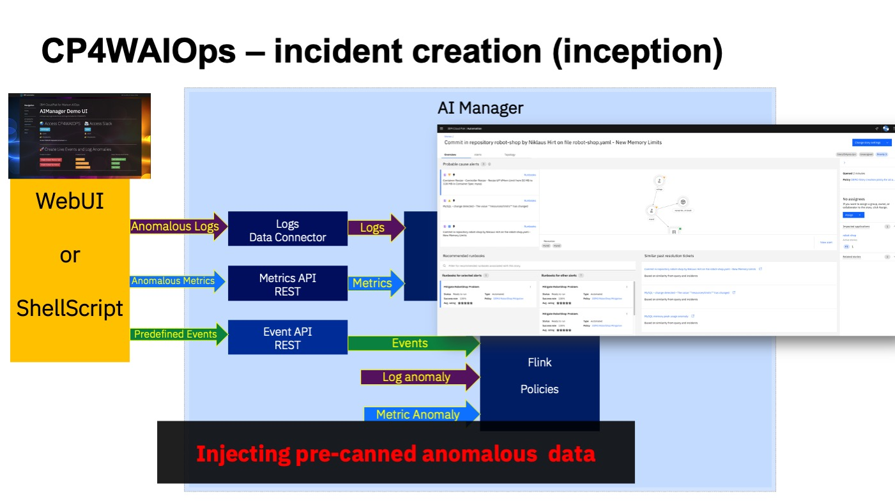
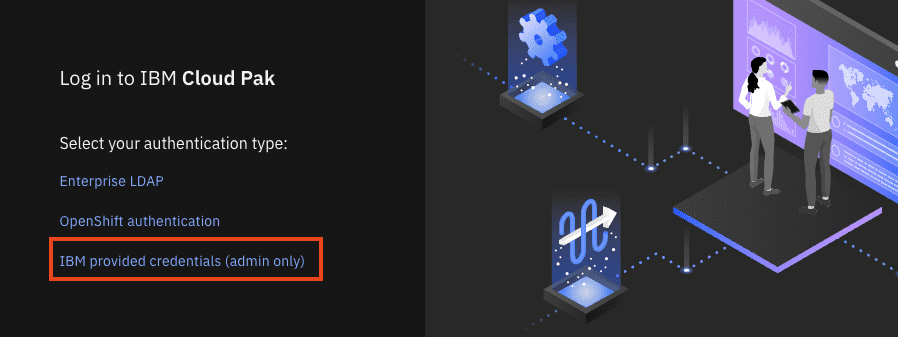
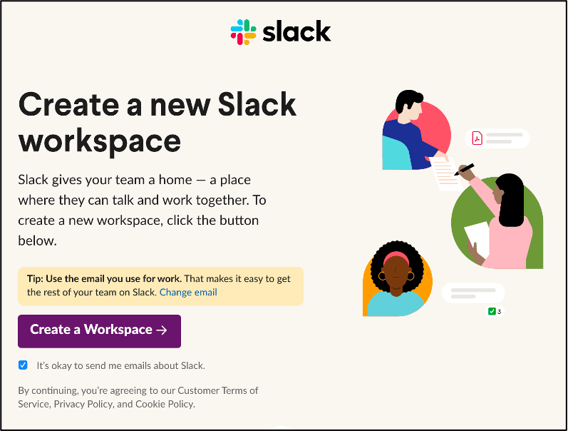
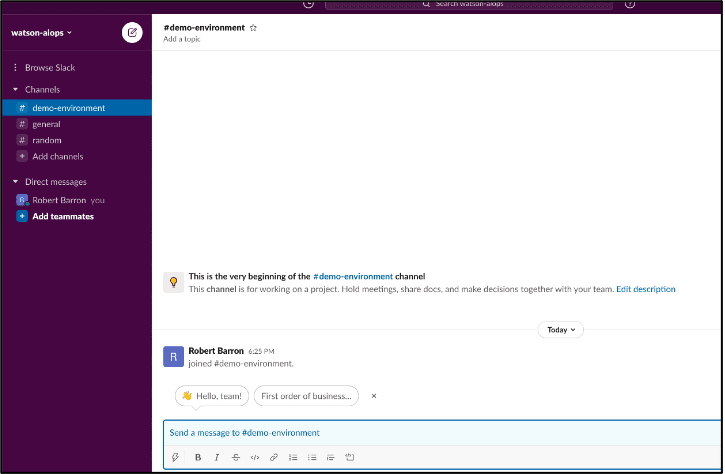
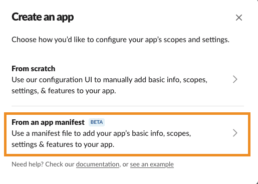
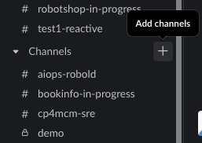
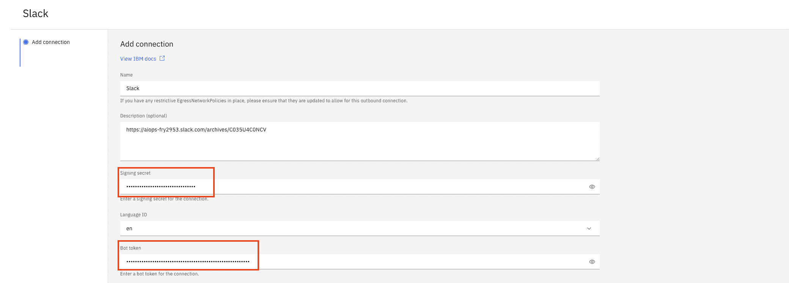
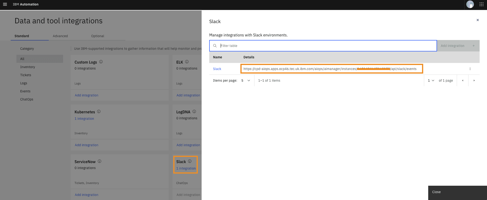
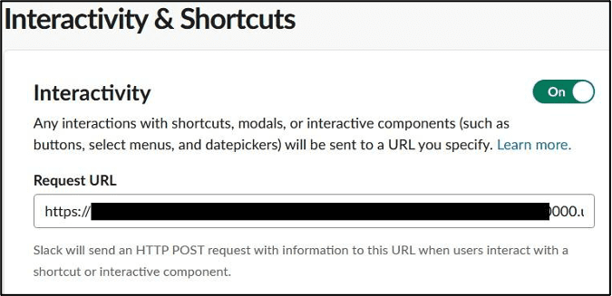

<center> <h1>CP4WatsonAIOps CP4WAIOPS v3.6.0</h1> </center>
<center> <h2>Demo Environment Installation 🚀</h2> </center>


<center> ©2022 Niklaus Hirt / IBM </center>


<div style="page-break-after: always;"></div>


### ❗ THIS IS WORK IN PROGRESS
Please drop me a note on Slack or by mail nikh@ch.ibm.com if you find glitches or problems.


> ## 🚨 You can now also install Instana into your Cluster


This is provided `as-is`:

* I'm sure there are errors
* I'm sure it's not complete
* It clearly can be improved


**❗This has been tested for the new CP4WAIOPS v3.6.0 release on OpenShift 4.10 on:**
- IBM RedHat Openshift Kubernetes Service (ROKS) with IBM Cloud Storage (ibmc-xxx)
- IBM RedHat Openshift Kubernetes Service (ROKS) with NFS Storage
- IBM RedHat Openshift Kubernetes Service (VPC Gen2 with ODF)
- OpenShift Cluster (VMware on IBM Cloud) - IPI


So please if you have any feedback contact me 

- on Slack: @niklaushirt or
- by Mail: nikh@ch.ibm.com


❗Those are **non-production** installations and are suited only for demo and PoC environments. ❗

Please refer to the official IBM Documentation for production ready installations.

<div style="page-break-after: always;"></div>


## 🚀 Demo Installation


🐥 [Quick Install](https://github.com/niklaushirt/cp4waiops-deployer#-1-quick-install)

🚀 [Demo the Solution](#2-demo-the-solution)

🤓 [Detailed Ansible Install](#-3-detailed-ansible-install) (optional)

📱 [Slack integration](#4-slack-integration) (optional)

> ❗You can find a PDF version of this guide here: [PDF](./INSTALL_CP4WAIOPS.pdf).
> 

> ℹ️ You can find a more detailed presentation about how the automation works here: [PDF](https://ibm.box.com/s/gx0tcubl9k4phvdsrffd7taragrmvz02).
> 


Here is a quick video that walks you through the installation process


<div style="page-break-after: always;"></div>

---------------------------------------------------------------
# 🐥 1 Quick Install
---------------------------------------------------------------

### ⚠️ **This method doesn't require you to install anything on your local machine.**

* You get a OpenShift Cluster
* You get your entitlement key/pull token
* You paste the install file into the OpenShift web UI
* Grab a coffe and come back after 2-3 hours depending on the modules you're installing


🚀 Already have a cluster? [Dive right in](#-12-install-ai-manager-with-demo-content)


> 🤓 So this could basically be done from an iPhone or iPad
 

<div style="page-break-after: always;"></div>

## ✅ 1.1 Prerequisites 

### ✅ 1.1.1 OpenShift requirements 

I installed the demo in a ROKS environment.

You'll need:

- ROKS 4.10
- 5x worker nodes Flavour `b3c.16x64` (so **16 CPU / 64 GB**)  ❗


You **might** get away with less if you don't install some components (Event Manager, ELK, Turbonomic,...) but no guarantee:

- Typically 4x worker nodes Flavour `b3c.16x64` _**for only AI Manager**_


### ✅ 1.1.2 Get a ROKS Cluster (IBMers and IBM Partners only)

IBMers can get a temporary one from [Techzone](https://techzone.ibm.com/collection/custom-roks-vmware-requests) (ususally valid for up to 8 days).


IBMers can get a temporary one from **Techzone**

You have different options:
[IBM RedHat Openshift Kubernetes Service (ROKS)](https://techzone.ibm.com/my/reservations/create/60da20f935e6ac001f1c4086)

Basic one that "just works)

[IBM RedHat Openshift Kubernetes Service (VPC Gen2 with ODF)](https://techzone.ibm.com/my/reservations/create/61415dd831cf9f00174c914b)
ROKS with ODF, but limited in CPU - you won't be able to install Instana AND Turbonomic on top

[OpenShift Cluster (VMware on IBM Cloud) - IPI](https://techzone.ibm.com/my/reservations/create/638e78ec5cad290018089470)
Gives you the most control


1. Select the Openshift that you want to use above

	The options might slightly vary depending on the option you choose.
 
1. Create a cluster for `Practice/Self Education` if you don't have an Opportunity Number

	

<div style="page-break-after: always;"></div>

1. Select the maximum end date that fits your needs (you can extend the duration once after creation)

	
	
1. Fill-in the remaining fields

	1. Geograpy: prefer **Dallas or London** (others might be slower)
	2. Worker node count: **5**
	3. Flavour: **b3c.16x64** ❗ 
	4. OpenShift Version: **4.10**
	5. If using IPI ro VPC select OCS/ODF Size 2TiB
	
	> ❗ If you want to install AIManager, Event Manager, Trubonomic and Instana please select **b3c.32x128** 

	

1. Click `Submit`
	
1. Once the cluster is provisioned, don't forget to extend it to 8 days if needed.


### ✅ 1.1.3 Get the CP4WAIOPS installation token (registry pull token) 

You can get the installation (registry pull token) token from [https://myibm.ibm.com/products-services/containerlibrary](https://myibm.ibm.com/products-services/containerlibrary).

This allows the CP4WAIOPS images to be pulled from the IBM Container Registry.

<div style="page-break-after: always;"></div>


## ⚠️⚠️ 1.2 Important remarks before you start ⚠️⚠️

Those are remarks to feedback and problem reports I got from the field.

Those scripts have been tested thoroughly on different environments and have proven to be VERY reliable.

If you think that you hit a problem:

* Make sure that you have provisioned a cluster with **5 worker nodes with 16 CPU and 64 GB** each (`b3c.16x64` - it's easy to select the wrong size). If you have Pods in `0/0` state verify the `Events`. If you get `Not enough CPU` then delete the cluster and provision the correct size.
* If you want to install AIManager, Event Manager, Trubonomic and Instana please select **5 worker nodes with 32 CPU and 128 GB** (`b3c.32x128`)
* When deploying ROKS I usually use Dallas or London, they are the fastest. On other regions we have seen much worse performance - deployment can take 4-5 times longer.
* The complete installation takes about 2.5 to 8 hours depending on your region where you deployed ROKS to (see above).
* If you see Pods in `CrashLoop` or other error states, try to wait it out (this can be due to dependencies on other componenets that are not ready yet). Chances are that the deployment will eventually go through. If after 8h you are still stuck, ping me.
* **Select and use ONLY ONE of the scripts** below, depending on which components you want to install.


### ❗ So simply put be patient and make sure you have the correct size of cluster provisioned!

<div style="page-break-after: always;"></div>

## 🐥 1.3 Quick Install 

You can use the scritps in the `Quick_Install` folder to rapidly spin up a demo environment.
The names should be self explaining and the headers of the files explain the modules to be installed.

> Basically you would to the following:
> 
> 1. In the the OCP Web UI click on the `+` sign in the right upper corner
> 1. Select the `Quick Install File` that fits your need from  [this directory](./Quick_Install/)
> 3. Replace `<REGISTRY_TOKEN>` at the end of the file with your pull token from step 1.1.3 (the Entitlement key from https://myibm.ibm.com)
> 3. Click `Save`	


> ℹ️❗ If you get a ClusterRoleBinding already exists, just ignore it

You can find some examples below.

### 🐥 1.3.1 Install AI Manager with demo content, Turbonomic and Instana 

> ### ✅ This is probably the one that you want.

You get AIManager installed and pre-trained in one simple script.
Ready to go.
On top of that you get Turbonomic and Instana instances to play around a bit (you'll need a license key for each).


1. In the the OCP Web UI click on the `+` sign in the right upper corner
1. Copy and paste the content from [this file](./Quick_Install/01_INSTALL_AIMGR_TURBO_INSTANA.yaml)
3. Replace `<REGISTRY_TOKEN>` at the end of the file with your pull token from step 1.1.3 (the Entitlement key from https://myibm.ibm.com)
4. Replace `<YOUR_SALES_KEY>` and  `<YOUR_AGENT_KEY>` at the end of the file with your Instana license
5. Replace the TURBO_LICENSE `NONE` at the end of the file with your Turbonomic license
3. Click `Save`

### **🚀 You can now go to [Demo the Solution](#2-demo-the-solution)**

This installation cocntains:

> - **AI Manager**
> 	- IBM Operator
> 	- AI Manager Instance
> - **AI Manager Demo Content**
>    - **OpenLDAP** & Register with AI Manager
> 
>    
>    - **AWX** (Open Source Ansible Tower) with preloaded Playbooks
>    - **AI Models** - Load and Train 
>      - Create Training Definitions (TG, LAD, CR, SI. Turn off RSA) 
>      - Create Training Data (LAD, SNOW) 
>      - Train Models (TG, LAD, CR, SI) 
>    - **Topology**
>      - RobotShop Demo App
>      - Create K8s Observer
>      - Create ASM merge rules
>      - Load Overlay Topology
>      - Create AI Manager Application
>    - **Misc**
> 	   - Creates valid certificate for Ingress (Slack) 
> 	   - External Routes (Flink, Topology, ...)
> 	   - Disables ASM Service match rule 
> 	   - Create Policy Creation for Stories and Runbooks 
> 	   - Demo Service Account 
> - **Turbonomic**
> - **Turbonomic Demo Content**
> 		- Demo User
> 		- RobotShop Demo App with synthetic metric
> 		- Instana target (if Instana is installed - you have to enter the API Token Manually)
> 		- Groups for vCenter and RobotShop
> 		- Groups for licensing
> 		- Resource Hogs
> - **Instana**
> 

<div style="page-break-after: always;"></div>

### 🐥 1.3.2 Install AI Manager, Event Manager with demo content

You get all the CP4WAIOPS components installed and pre-trained in one simple script.
Ready to go.


1. In the the OCP Web UI click on the `+` sign in the right upper corner
1. Copy and paste the content from [this file](./Quick_Install/01_INSTALL_AIMGR_EVTMGR.yaml)
3. Replace `<REGISTRY_TOKEN>` at the end of the file with your pull token from step 1.1.3 (the Entitlement key from https://myibm.ibm.com)
3. Click `Save`

### **🚀 You can now go to [Demo the Solution](#2-demo-the-solution)**

This installation cocntains:

> - **AI Manager**
> 	- IBM Operator
> 	- AI Manager Instance
> - **AI Manager Demo Content**
>    - **OpenLDAP** & Register with AI Manager
> 
>    
>    - **AWX** (Open Source Ansible Tower) with preloaded Playbooks
>    - **AI Models** - Load and Train 
>      - Create Training Definitions (TG, LAD, CR, SI. Turn off RSA) 
>      - Create Training Data (LAD, SNOW) 
>      - Train Models (TG, LAD, CR, SI) 
>    - **Topology**
>      - RobotShop Demo App
>      - Create K8s Observer
>      - Create ASM merge rules
>      - Load Overlay Topology
>      - Create AI Manager Application
>    - **Misc**
> 	   - Creates valid certificate for Ingress (Slack) 
> 	   - External Routes (Flink, Topology, ...)
> 	   - Disables ASM Service match rule 
> 	   - Create Policy Creation for Stories and Runbooks 
> 	   - Demo Service Account 
> - **Event Manager**
> 	- Event Manager
> - **Event Manager Demo Content**
>   - **Topology**
>     - Create ASM merge rules
>     - Load ASM merge Topology
>     - Create AI Manager Application
> 

<div style="page-break-after: always;"></div>


### 🐥 1.3.2 Custom Install

1. Open the [00\_INSTALL_CUSTOM.yaml](./Quick_Install/00_INSTALL_CUSTOM.yaml) file
1. Adap the installation configuration to your needs. Select the modules to install and their configuration.

	```yaml
	- name: cp4waiops-aimanager
	  kind: AIManager						<-- The feature to be configured
	  install: true							<-- Install yes/no
	
	  # current_cp4waiops_feature			<-- Configuration of the feature
	  # CP4WAIOPS Size of the install
	  waiops_size: small
	  ...
	  # Version of the catalog subscription
	  subscription_channel: v3.6
	
	```
	
1. Replace `<REGISTRY_TOKEN>` at the end of the file with your pull token from step 1.1.3 (the Entitlement key from https://myibm.ibm.com)
1. Copy the content
1. In the the OCP Web UI click on the `+` sign in the right upper corner
1. Paste the content
1. Click `Save`
2. 
### **🚀 You can now go to [Demo the Solution](#2-demo-the-solution)**

This installation cocntains:


## 1.4 Configure Slack

Continue [here](#4-slack-integration) for [Slack integration](#4-slack-integration)

<div style="page-break-after: always;"></div>

## 1.5 Access the Environment

Once the installation has finisehd, you can access the demo environment:


* Click on the Application Menu <svg fill="currentColor" height="1em" width="1em" viewBox="0 0 512 512" aria-hidden="true" role="img" style="vertical-align: -0.125em;"><path d="M149.333 56v80c0 13.255-10.745 24-24 24H24c-13.255 0-24-10.745-24-24V56c0-13.255 10.745-24 24-24h101.333c13.255 0 24 10.745 24 24zm181.334 240v-80c0-13.255-10.745-24-24-24H205.333c-13.255 0-24 10.745-24 24v80c0 13.255 10.745 24 24 24h101.333c13.256 0 24.001-10.745 24.001-24zm32-240v80c0 13.255 10.745 24 24 24H488c13.255 0 24-10.745 24-24V56c0-13.255-10.745-24-24-24H386.667c-13.255 0-24 10.745-24 24zm-32 80V56c0-13.255-10.745-24-24-24H205.333c-13.255 0-24 10.745-24 24v80c0 13.255 10.745 24 24 24h101.333c13.256 0 24.001-10.745 24.001-24zm-205.334 56H24c-13.255 0-24 10.745-24 24v80c0 13.255 10.745 24 24 24h101.333c13.255 0 24-10.745 24-24v-80c0-13.255-10.745-24-24-24zM0 376v80c0 13.255 10.745 24 24 24h101.333c13.255 0 24-10.745 24-24v-80c0-13.255-10.745-24-24-24H24c-13.255 0-24 10.745-24 24zm386.667-56H488c13.255 0 24-10.745 24-24v-80c0-13.255-10.745-24-24-24H386.667c-13.255 0-24 10.745-24 24v80c0 13.255 10.745 24 24 24zm0 160H488c13.255 0 24-10.745 24-24v-80c0-13.255-10.745-24-24-24H386.667c-13.255 0-24 10.745-24 24v80c0 13.255 10.745 24 24 24zM181.333 376v80c0 13.255 10.745 24 24 24h101.333c13.255 0 24-10.745 24-24v-80c0-13.255-10.745-24-24-24H205.333c-13.255 0-24 10.745-24 24z"></path></svg> in your Openshift Web Console.
* Select `CP4WAIOps Demo UI`
* Login with the password `P4ssw0rd!`

	


<div style="page-break-after: always;"></div>

---------------------------------------------------------------
# 2 Demo the Solution
---------------------------------------------------------------

## 2.1 Simulate incident - Web Demo UI

📹 I have added a short [Demo Walkthrough video](https://ibm.box.com/s/a4zbl8rjevxqfe48yxgatgmhomsiu8wl) that you can watch to get an idea on how to do the demo. This is based on 3.2 and the [Click Through PPT](https://ibm.box.com/s/icgkxzlt2ja6dth16dpdin055uyysej1), but should work more or less with your own instance.

## 2.1.1 Access the Environment

To access the demo environment:

* Click on the Application Menu <svg fill="currentColor" height="1em" width="1em" viewBox="0 0 512 512" aria-hidden="true" role="img" style="vertical-align: -0.125em;"><path d="M149.333 56v80c0 13.255-10.745 24-24 24H24c-13.255 0-24-10.745-24-24V56c0-13.255 10.745-24 24-24h101.333c13.255 0 24 10.745 24 24zm181.334 240v-80c0-13.255-10.745-24-24-24H205.333c-13.255 0-24 10.745-24 24v80c0 13.255 10.745 24 24 24h101.333c13.256 0 24.001-10.745 24.001-24zm32-240v80c0 13.255 10.745 24 24 24H488c13.255 0 24-10.745 24-24V56c0-13.255-10.745-24-24-24H386.667c-13.255 0-24 10.745-24 24zm-32 80V56c0-13.255-10.745-24-24-24H205.333c-13.255 0-24 10.745-24 24v80c0 13.255 10.745 24 24 24h101.333c13.256 0 24.001-10.745 24.001-24zm-205.334 56H24c-13.255 0-24 10.745-24 24v80c0 13.255 10.745 24 24 24h101.333c13.255 0 24-10.745 24-24v-80c0-13.255-10.745-24-24-24zM0 376v80c0 13.255 10.745 24 24 24h101.333c13.255 0 24-10.745 24-24v-80c0-13.255-10.745-24-24-24H24c-13.255 0-24 10.745-24 24zm386.667-56H488c13.255 0 24-10.745 24-24v-80c0-13.255-10.745-24-24-24H386.667c-13.255 0-24 10.745-24 24v80c0 13.255 10.745 24 24 24zm0 160H488c13.255 0 24-10.745 24-24v-80c0-13.255-10.745-24-24-24H386.667c-13.255 0-24 10.745-24 24v80c0 13.255 10.745 24 24 24zM181.333 376v80c0 13.255 10.745 24 24 24h101.333c13.255 0 24-10.745 24-24v-80c0-13.255-10.745-24-24-24H205.333c-13.255 0-24 10.745-24 24z"></path></svg> in your Openshift Web Console.
* Select `CP4WAIOps Demo UI`
* Login with the password `P4ssw0rd!`

	


<div style="page-break-after: always;"></div>

## 2.1.2 Login to AI Manager as demo User

* Click on the blue `AI Manager` button
* Login as User `demo` with the Password `P4ssw0rd!`


## 2.1.3 Simulate the incident

Back on the Demo UI, click on the red `Create Incident Memory Leak` button

This will create alerts and a story in AI Manager.


ℹ️  Give it a minute or two for all events and anomalies to arrive in AI Manager and Slack.


<div style="page-break-after: always;"></div>


<div style="page-break-after: always;"></div>


## 2.2 Demo Setup - Explained

### 2.2.1 Basic Architecture

The environement (Kubernetes, Applications, ...) create logs that are being fed into a Log Management Tool (ELK in this case).


1. External Systems generate Alerts and send them into the AI Manager for Event Grouping.
1. At the same time AI Manager ingests the raw logs coming from the Log Management Tool (ELK) and looks for anomalies in the stream based on the trained model.
2. It also ingests Metric Data and looks for anomalies
1. If it finds an anomaly (logs and/or metrics) it forwards it to the Event Grouping as well.
1. Out of this, AI Manager creates a Story that is being enriched with Topology (Localization and Blast Radius) and with Similar Incidents that might help correct the problem.
1. The Story is then sent to Slack.
1. A Runbook is available to correct the problem but not launched automatically.

<div style="page-break-after: always;"></div>

### 2.2.2 Optimized Demo Architecture

The idea of this repo is to provide a optimised, complete, pre-trained demo environment that is self-contained (e.g. can be deployed in only one cluster)

It contains the following components (which can be installed independently):

 - **AI Manager**
 	- IBM Operator
 	- AI Manager Instance
 - **AI Manager Demo Content**  (optional)
    - **OpenLDAP** & Register with AI Manager
    - **AWX** (Open Source Ansible Tower) with preloaded Playbooks
    - **AI Models** - Load and Train 
      - Create Training Definitions (TG, LAD, CR, SI. Turn off RSA) 
      - Create Training Data (LAD, SNOW) 
      - Train Models (TG, LAD, CR, SI) 
    - **Topology**
      - RobotShop Demo App
      - Create K8s Observer
      - Create ASM merge rules
      - Load Overlay Topology
      - Create AI Manager Application
    - **Misc**
 	   - Creates valid certificate for Ingress (Slack) 
 	   - External Routes (Flink, Topology, ...)
 	   - Disables ASM Service match rule 
 	   - Create Policy Creation for Stories and Runbooks 
 	   - Demo Service Account 
 - **Event Manager**  (optional)
 	- Event Manager
 - **Event Manager Demo Content**  (optional)
   - **Topology**
     - Create ASM merge rules
     - Load ASM merge Topology
     - Create AI Manager Application
 - **Turbonomic**  (optional)
 - **Turbonomic Demo Content** (optional)
	- Demo User
	- RobotShop Demo App with synthetic metric
	- Instana target (if Instana is installed - you have to enter the API Token Manually)
	- Groups for vCenter and RobotShop
	- Groups for licensing
	- Resource Hogs
 - **Instana**  (optional)


For the this specific Demo environment:

* ELK is not needed as I am using pre-canned logs for training and for the anomaly detection (inception)
* Same goes for Metrics, I am using pre-canned metric data for training and for the anomaly detection (inception)
* The Events are also created from pre-canned content that is injected into AI Manager
* There are also pre-canned ServiceNow Incidents if you don’t want to do the live integration with SNOW
* The Webpages that are reachable from the Events are static and hosted on my GitHub
* The same goes for ServiceNow Incident pages if you don’t integrate with live SNOW

This allows us to:

* Install the whole Demo Environment in a self-contained OCP Cluster
* Trigger the Anomalies reliably
* Get Events from sources that would normally not be available (Instana, Turbonomic, Log Aggregator, Metric Provider, ...)
* Show some examples of SNOW integration without a live system


<div style="page-break-after: always;"></div>

### 2.2.3 Training

#### 2.2.3.1 Loading training data


Loading Training data is done at the lowest possible level (for efficiency and speed):

* Logs: Loading Elastic Search indexes directly into ES - two days of logs for March 3rd and 4th 2022
* SNOW: Loading Elastic Search indexes directly into ES - synthetic data with 15k change requests and 5k incidents
* Metrics: Loading Cassandra dumps of metric data - 3 months of synthetic data for 13 KPIs


#### 2.2.3.2 Training the models

The models can be trained directly on the data that has been loaded as described above.


<div style="page-break-after: always;"></div>


### 2.2.4 Incident creation (inception)



Incidents are being created by using the high level APIs in order to simulate a real-world scenario.

* Events: Pre-canned events are being injected through the corresponding REST API
* Logs: Pre-canned anomalous logs for a 30 min timerange are injected through Kafka
* Metrics: Anomalous metric data are generated on the fly and injected via the corresponding REST API


<div style="page-break-after: always;"></div>

---------------------------------------------------------------
# 🚀 3 Detailed Ansible Install
---------------------------------------------------------------


## 3.1 Get the code 


Clone the GitHub Repository

```
git clone https://github.com/niklaushirt/cp4waiops-deployer.git -b cp4waiops_stable
```


## 3.2 Prerequisites 


### 3.2.1 OpenShift requirements 

I installed the demo in a ROKS environment.

You'll need:

- ROKS 4.10
- 5x worker nodes Flavour `b3c.16x64` (so 16 CPU / 64 GB) 


You **might** get away with less if you don't install some components (Event Manager, ELK, Turbonomic,...) but no guarantee:

- Typically 4x worker nodes Flavour `b3c.16x64` _**for only AI Manager**_

<div style="page-break-after: always;"></div>

### 3.2.2 Get a ROKS Cluster (IBMers and IBM Partners only)

IBMers can get a temporary one from [Techzone](https://techzone.ibm.com/collection/custom-roks-vmware-requests) (ususally valid for 2 weeks)

1. Create a cluster for `Practice/Self Education` if you don't have an Opportunity Number

	

1. Select the maximum end date that fits your needs (you can extend the duration once after creation)

	
	
1. Fill-in the remaining fields

	1. Geograpy: whatever is closest to you
	2. Worker node count: 5
	3. Flavour: b3c.16x64
	4. OpenShift Version: 4.10

	

1. Click `Submit`

<div style="page-break-after: always;"></div>

### 3.2.3 Tooling 

❗ Only needed if you decide to install from your PC

You need the following tools installed in order to follow through this guide:

- ansible
- oc (4.8 or greater)
- jq
- kafkacat (only for training and debugging)
- elasticdump (only for training and debugging)
- IBM cloudctl (only for LDAP)


#### 3.2.3.1 On Mac - Automated (preferred) 

*Only needed if you decide to install from your PC*

Just run:

```bash
./tools/10_prerequisites/install_prerequisites_mac.sh
```

#### 3.2.3.2 On Ubuntu - Automated (preferred) 

*Only needed if you decide to install from your PC*

Just run:

```bash
./tools/10_prerequisites/install_prerequisites_ubuntu.sh
```

 

<div style="page-break-after: always;"></div>

### 3.2.4 Get the CP4WAIOPS installation token (registry pull token) 

You can get the installation (registry pull token) token from [https://myibm.ibm.com/products-services/containerlibrary](https://myibm.ibm.com/products-services/containerlibrary).

This allows the CP4WAIOPS images to be pulled from the IBM Container Registry.

<div style="page-break-after: always;"></div>

## 3.3 AI Manager Installation


You have different options:
	
1. **Install from your PC** *with the token from 1.3.1*
	```bash
	ansible-playbook ./ansible/01_cp4waiops-aimanager-all.yaml -e cp_entitlement_key=<REGISTRY_TOKEN> 
	```
	
1. **Install with the Easy Installer** *with the token from 1.3.1*
	1. Just run:
		```bash
		./01_easy-install.sh -t <REGISTRY_TOKEN>
		```

	2. Select option 🐥`10` to install the complete `AI Manager` environment with Demo Content.


> This takes about 1.5 to 2 hours.
> After completion Easy Installer will open the documentation and the AI Manager webpage (on Mac) and you'll have to to perform the last manual steps.

> You now have a full, basic installtion of AI Manager with:
> 
>  - AI Manager
>  - Open LDAP & Register with AI Manager
>  - RobotShop demo application
>  - Trained Models based on pre-canned data (Log- and Metric Anomalies, Similar Incidents, Change Risk)
>  - Topologies for demo scenarios
>  - AWX (OpenSource Ansible Tower) with runbooks for the demo scenarios
>  - Demo UI
>  - Demo Service Account 
>  - Valid certificate for Ingress (Slack) 
>  - External Routes (Flink, Topology, ...)
>  - Policies for Stories and Runbooks 
> 


 <div style="page-break-after: always;"></div>
 

### 3.3.1 AI Manager Configuration 


Those are the manual configurations you'll need to demo the system and that are covered by the flow above.
 

**Configure Slack**
 
Continue [here](#4-slack-integration) for [Slack integration](#4-slack-integration)


### 3.3.2 First Login

After successful installation, the Playbook creates a file `./LOGINS.txt` in your installation directory (only if you installed from your PC).

> ℹ️ You can also run `./tools/20_get_logins.sh` at any moment. This will print out all the relevant passwords and credentials.

#### 3.3.2.1 Get the URL

* Run `./tools/20_get_logins.sh` to get all the logins and URLs

or

* Run:

```bash
export WAIOPS_NAMESPACE=$(oc get po -A|grep aiops-orchestrator-controller |awk '{print$1}')
	
echo "🌏 AI Manager:           https://$(oc get route -n $WAIOPS_NAMESPACE cpd -o jsonpath={.spec.host})"
echo "🌏 Demo UI:              https://$(oc get route -n $WAIOPS_NAMESPACE waiops-demo-ui-python -o jsonpath={.spec.host})"

```

<div style="page-break-after: always;"></div>

### 3.3.3 Login as demo User (preferred)

* Open the URL from the above
* Click on `Enterprise LDAP`
* Login as `demo` with the password `P4ssw0rd!`


#### 3.3.3.1 Login as admin

* Open the URL from the above
* Click on `IBM provided credentials (admin only)`

	


* Login as `admin` with the password from the `LOGINS.txt` file

	


<div style="page-break-after: always;"></div>

## 3.4 Demo the Solution


### 3.4.1 Simulate incident - Web Demo UI


#### 3.4.1.1 Get the URL

* Run:

	```bash
	export WAIOPS_NAMESPACE=$(oc get po -A|grep aiops-orchestrator-controller |awk '{print$1}')
		
	echo "🌏 AI Manager:           https://$(oc get route -n $WAIOPS_NAMESPACE cpd -o jsonpath={.spec.host})"
	echo "🌏 Demo UI:              https://$(oc get route -n $WAIOPS_NAMESPACE waiops-demo-ui-python -o jsonpath={.spec.host})"
	
	```
	
	
	

#### 3.4.1.2 Open the Web Demo UI

* Open the Demo UI URL from the above
* Login with the password `P4ssw0rd!`

<div style="page-break-after: always;"></div>

#### 3.4.1.3 Simulate the incident

Click on the red `Create Incident Memory Leak` button

This will create alerts and a story in AI Manager.


<div style="page-break-after: always;"></div>

#### 3.4.1.2 Login to AI Manager as demo User

* Open the AI Manager URL from the above
* Click on `Enterprise LDAP`
* Login as `demo` with the password `P4ssw0rd!`

ℹ️  Give it a minute or two for all events and anomalies to arrive in AI Manager and Slack.


### 3.4.2 Simulate incident - Command Line

**Make sure you are logged-in to the Kubernetes Cluster first** 

In the terminal type 

```bash
./22_simulate_incident_robotshop.sh
```

This will delete all existing Alerts/Stories and inject pre-canned event, metrics and logs to create a story.

ℹ️  Give it a minute or two for all events and anomalies to arrive in AI Manager and Slack.
ℹ️  You might have to run the script 3-4 times for the log anomalies to start appearing.


<div style="page-break-after: always;"></div>

## 3.5 Event Manager Installation


You have different options:

1. **Install directly from the OCP Web UI** *(no need to install anything on your PC)*
	1. In the the OCP Web UI click on the + sign in the right upper corner
	1. Copy and paste the content from [this file](./Quick_Install/03_INSTALL_EVTMGR_ALL.yaml)
	2. Replace `<REGISTRY_TOKEN>` at the end of the file with your pull token from step 1.3.1
	3. Click `Save`
	
1. **Install from your PC** *with the token from 1.3.1*
	```bash
	ansible-playbook ./ansible/04_cp4waiops-eventmanager-all.yaml -e cp_entitlement_key=<REGISTRY_TOKEN> 
	```
	
1. **Install with the Easy Installer** *with the token from 1.3.1*
	1. Just run:
		```bash
		./01_easy-install.sh -t <REGISTRY_TOKEN>
		```

	2. Select option 🐥`02` to install the complete `Event Manager` environment with Demo Content.


> This takes about 1 hour.


 <div style="page-break-after: always;"></div>
 


### 3.5.2 First Login

After successful installation, the Playbook creates a file `./LOGINS.txt` in your installation directory (only if you installed from your PC).

> ℹ️ You can also run `./tools/20_get_logins.sh` at any moment. This will print out all the relevant passwords and credentials.

#### 3.5.2.1 Login as smadmin

* Open the `LOGINS.txt` file that has been created by the Installer in your root directory
* Open the URL from the `LOGINS.txt` file
* Login as `smadmin` with the password from the `LOGINS.txt` file

<div style="page-break-after: always;"></div>

### 3.5.3 Integration with AI Manager

* To get the connection parameters, run:

```bash
./tools/97_addons/prepareNetcoolIntegration.sh
```

> Execute the listed commads at the Objectserver prompt. 
> 
> This gives you all the parameters needed for creating the connection.
  
* In the `AI Manager` "Hamburger" Menu select `Operate`/`Data and tool integrations`
* Click `Add connection`
* Under `Netcool`, click on `Add connection`
* Click `Connect`
* Name it `Netcool`
* Fill-in the information from the script above

* Click `Test Connection`
* Click `Next`
* Toggle `Enable Data Collection` to the `ON` position
* Click `Save`


<div style="page-break-after: always;"></div>

### 3.5.4 Event Manager Configuration 

#### 3.5.4.1 EventManager Webhook 

Create Webhooks in EventManager for Event injection and incident simulation for the Demo.

The demo scripts (in the `demo` folder) give you the possibility to simulate an outage without relying on the integrations with other systems.

At this time it simulates:

- Git push event
- Log Events (ELK)
- Security Events (Falco)
- Instana Events
- Metric Manager Events (Predictive)
- Turbonomic Events
- CP4MCM Synthetic Selenium Test Events


You have to define the following Webhook in EventManager (NOI): 

* `Administration` / `Integration with other Systems`
* `Incoming` / `New Integration`
* `Webhook`
* Name it `Demo Generic`
* Jot down the WebHook URL and copy it to the `NETCOOL_WEBHOOK_GENERIC` in the `./tools/01_demo/incident_robotshop-noi.sh`file
* Click on `Optional event attributes`
* Scroll down and click on the + sign for `URL`
* Click `Confirm Selections`


Use this json:

```json
{
  "timestamp": "1619706828000",
  "severity": "Critical",
  "summary": "Test Event",
  "nodename": "productpage-v1",
  "alertgroup": "robotshop",
  "url": "https://pirsoscom.github.io/grafana-robotshop.html"
}
```
<div style="page-break-after: always;"></div>

Fill out the following fields and save:

* Severity: `severity`
* Summary: `summary`
* Resource name: `nodename`
* Event type: `alertgroup`
* Url: `url`
* Description: `"URL"`

Optionnally you can also add `Expiry Time` from `Optional event attributes` and set it to a convenient number of seconds (just make sure that you have time to run the demo before they expire.

<div style="page-break-after: always;"></div>


#### 3.5.4.2 Create custom Filters and Views


##### 3.5.4.2.1 Filter 


* In the `Event Manager` "Hamburger" Menu select `Netcool WebGui`
* Click `Administration`
* Click `Filters`
* Select `Global Filters` from the DropDown menu
* Select `Default`
* Click `Copy Filter` (the two papers on the top left) 
* Set to `global`
* Click `Ok`
* Name: AIOPS
* Logic: **Any** ❗ (the right hand option)
* Filter:
	* AlertGroup = 'CEACorrelationKeyParent'
	* AlertGroup = 'robot-shop'


##### 3.5.4.2.2 View 
* In the `Event Manager` "Hamburger" Menu select `Netcool WebGui`
* Click `Administration`
* Click `Views`
* Select `System Views` from the DropDown menu
* Select `Example_IBM_CloudAnalytics`
* Click `Copy View` (the two papers on the top left) 
* Set to `global`
* Click `Ok`
* Name: AIOPS
* Configure to your likings.


#### 3.5.4.3 Create grouping Policy 

* In the `Event Manager` "Hamburger" Menu select `Netcool WebGui`
* Click `Insights`
* Click `Scope Based Grouping`
* Click `Create Policy`
* `Action` select fielt `Alert Group`
* Toggle `Enabled` to `On`
* Save

<div style="page-break-after: always;"></div>

#### 3.5.4.4 Create Menu item

In the Netcool WebGUI

* Go to `Administration` / `Tool Configuration`
* Click on `LaunchRunbook`
* Copy it (the middle button with the two sheets)
* Name it `Launch URL`
* Replace the Script Command with the following code

	```javascript
	var urlId = '{$selected_rows.URL}';
	
	if (urlId == '') {
	    alert('This event is not linked to an URL');
	} else {
	    var wnd = window.open(urlId, '_blank');
	}
	```
* Save

Then 

* Go to `Administration` / `Menu Configuration`
* Select `alerts`
* Click on `Modify`
* Move Launch URL to the right column
* Save


	
<div style="page-break-after: always;"></div>


---------------------------------------------------------------
# 4 Slack integration
---------------------------------------------------------------


For the system to work you need to follow those steps:


1. Create Slack Workspace
1. Create Slack App
1. Create Slack Channels
1. Create Slack Integration
1. Get the Integration URL
1. Create Slack App Communications
1. Slack Reset

<div style="page-break-after: always;"></div>


## 4.1 Create your Slack Workspace

1. Create a Slack workspace by going to https://slack.com/get-started#/createnew and logging in with an email <i>**which is not your IBM email**</i>. Your IBM email is part of the IBM Slack enterprise account and you will not be able to create an independent Slack workspace outside if the IBM slack service. 

  

2. After authentication, you will see the following screen:

  

3. Click **Create a Workspace** ->

4. Name your Slack workspace

  

  Give your workspace a unique name such as aiops-\<yourname\>.

5. Describe the workspace current purpose

  

  This is free text, you may simply write “demo for Watson AIOps” or whatever you like.

6. 

  

  You may add team members to your new Slack workspace or skip this step.


At this point you have created your own Slack workspace where you are the administrator and can perform all the necessary steps to integrate with CP4WAOps.



**Note** : This Slack workspace is outside the control of IBM and must be treated as a completely public environment. Do not place any confidential material in this Slack workspace.

<div style="page-break-after: always;"></div>

## 4.2 Create Your Slack App

1. Create a Slack app, by going to https://api.slack.com/apps and clicking `Create New App`. 

   


2. Select `From an app manifest`


  

3. Select the appropriate workspace that you have created before and click `Next`

4. Copy and paste the content of this file [./doc/slack/slack-app-manifest.yaml](./doc/slack/slack-app-manifest.yaml).

	Don't bother with the URLs just yet, we will adapt them as needed.

5. Click `Next`

5. Click `Create`

6. Scroll down to Display Information and name your CP4WAIOPS app.

7. You can add an icon to the app (there are some sample icons in the ./tools/4_integrations/slack/icons folder.

8. Click save changes

9. In the `Basic Information` menu click on `Install to Workspace` then click `Allow`

<div style="page-break-after: always;"></div>

## 4.3 Create Your Slack Channels


1. In Slack add a two new channels:
	* aiops-demo-reactive
	* aiops-demo-proactive

	


2. Right click on each channel and select `Copy Link`

	This should get you something like this https://xxxx.slack.com/archives/C021QOY16BW
	The last part of the URL is the channel ID (i.e. C021QOY16BW)
	Jot them down for both channels
	
3. Under Apps click Browse Apps

	

4. Select the App you just have created

5. Invite the Application to each of the two channels by typing

	```bash
	@<MyAppname>
	```

6. Select `Add to channel`

	You shoud get a message from <MyAppname> saying `was added to #<your-channel> by ...`


<div style="page-break-after: always;"></div>

## 4.4 Integrate Your Slack App

In the Slack App: 

1. In the `Basic Information` menu get the `Signing Secret` (not the Client Secret!) and jot it down

	
	
3. In the `OAuth & Permissions` get the `Bot User OAuth Token` (not the User OAuth Token!) and jot it down

	

In the AI Manager (CP4WAIOPS) 

1. In the `AI Manager` "Hamburger" Menu select `Define`/`Data and tool integrations`
1. Click `Add connection`
 
	
	
1. Under `Slack`, click on `Add Connection`
	

6. Name it "Slack"
7. Paste the `Signing Secret` from above
8. Paste the `Bot User OAuth Token` from above

	
	
9. Paste the channel IDs from the channel creation step in the respective fields

	
	
	
		
		

10. Test the connection and click save


<div style="page-break-after: always;"></div>

## 4.5 Create the Integration URL

In the AI Manager (CP4WAIOPS) 

1. Go to `Data and tool integrations`
2. Under `Slack` click on `1 integration`
3. Copy out the URL

	

This is the URL you will be using for step 6.


<div style="page-break-after: always;"></div>

## 4.6 Create Slack App Communications

Return to the browser tab for the Slack app. 

### 4.6.1 Event Subscriptions

1. Select `Event Subscriptions`.

2. In the `Enable Events` section, click the slider to enable events. 

3. For the Request URL field use the `Request URL` from step 5.

	e.g: `https://<my-url>/aiops/aimanager/instances/xxxxx/api/slack/events`

4. After pasting the value in the field, a *Verified* message should display.

	

	If you get an error please check 5.7

5. Verify that on the `Subscribe to bot events` section you got:

	*  `app_mention` and 
	*  `member_joined_channel` events.

	

6. Click `Save Changes` button.


### 4.6.2 Interactivity & Shortcuts

7. Select `Interactivity & Shortcuts`. 

8. In the Interactivity section, click the slider to enable interactivity. For the `Request URL` field, use use the URL from above.

 **There is no automatic verification for this form**



9. Click `Save Changes` button.

### 4.6.3 Slash Commands

Now, configure the `welcome` slash command. With this command, you can trigger the welcome message again if you closed it. 

1. Select  `Slash Commands`

2. Click `Create New Command` to create a new slash command. 

	Use the following values:
	
	
	| Field | Value |
	| --- | --- |
	|Command| /welcome|
	|Request URL|the URL from above|
	|Short Description| Welcome to Watson AIOps|

3. Click `Save`.

### 4.6.4 Reinstall App

The Slack app must be reinstalled, as several permissions have changed. 

1. Select `Install App` 
2. Click `Reinstall to Workspace`

Once the workspace request is approved, the Slack integration is complete. 

If you run into problems validating the `Event Subscription` in the Slack Application, see 5.2

<div style="page-break-after: always;"></div>

<div style="page-break-after: always;"></div>


<div style="page-break-after: always;"></div>

## 4.7 Slack Reset


### 4.7.1 Get the User OAUTH Token

This is needed for the reset scripts in order to empty/reset the Slack channels.

This is based on [Slack Cleaner2](https://github.com/sgratzl/slack_cleaner2).
You might have to install this:

```bash
pip3 install slack-cleaner2
```
#### Reset reactive channel 

In your Slack app

1. In the `OAuth & Permissions` get the `User OAuth Token` (not the Bot User OAuth Token this time!) and jot it down

In file `./tools/98_maintenance/scripts/13_reset-slack.sh`

2. Replace `not_configured` for the `SLACK_TOKEN` parameter with the token 
3. Adapt the channel name for the `SLACK_REACTIVE` parameter


#### Reset proactive channel 

In your Slack app

1. In the `OAuth & Permissions` get the `User OAuth Token` (not the Bot User OAuth Token this time!) and jot it down (same token as above)

In file `./tools/98_maintenance/scripts/14_reset-slack-changerisk.sh`

2. Replace `not_configured` for the `SLACK_TOKEN` parameter with the token 
3. Adapt the channel name for the `SLACK_PROACTIVE` parameter


### 4.7.2 Perform Slack Reset

Call either of the scripts above to reset the channel:

```bash

./tools/98_maintenance/scripts/13_reset-slack.sh

or

./tools/98_maintenance/scripts/14_reset-slack-changerisk.sh

```

## ℹ️ Old documentation for reference

### ⚠️❗Many of those will not work anymore and are here just to give you some pointers

* Info
	* [Changelog](./CHANGELOG.md)
	* [Demo Architecture](./doc/ARCHITECTURE.md)
	* [Detailed Prerequisites](./doc/PREREQUISITES.md)
	* [Troubleshooting](./doc/TROUBLESHOOTING.md)
* Installation
	* [Event Manager Install](./doc/INSTALL_EVENT_MANAGER.md)
	* [Event Manager Configuration](./doc/CONF_EVENT_MANAGER.md)
	* [Uninstall CP4WAIOPS](./doc/UNINSTALL.md)
* Configuration
	* [Manual Runbook Configuration](./doc/CONF_RUNBOOKS.md)
	* [Additional Configuration](./doc/CONF_MISC.md)
	* [Service Now integration](./doc/INTEGRATION_SNOW.md)
* Install additional components
	* [Installing Turbonomic](./doc/INSTALL_TURBONOMIC.md)
	* [Installing ELK ](./doc/INSTALL_ELK.md)


